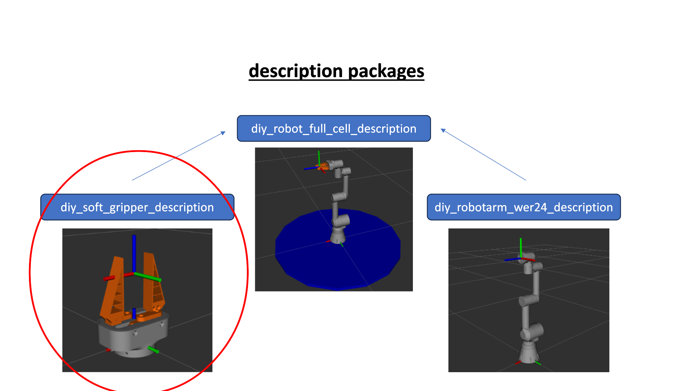

# DIY-SoftGripper

## thematical Classification
This repository contains a ROS2 package which contains the description files for our developed parallel kinematics gripper with adaptive soft-fingers attached.

The main idea is, that this repo can be cloned inside a docker container containing and combining all description packages for the whole scene (e.g. Base, Robot, Gripper, additional obstacles)
Using differnet docker containers is very likely, because this makes the whole integration very modular. To get further informations about the general structural approach of the ROS integration, please refer to this readme: https://github.com/mathias31415/diy_robotics/blob/main/ROS-Packages/ROS-OVERVIEW.md

## Package Structure

## URDF Definition

## Launch Files and parametrized Values

